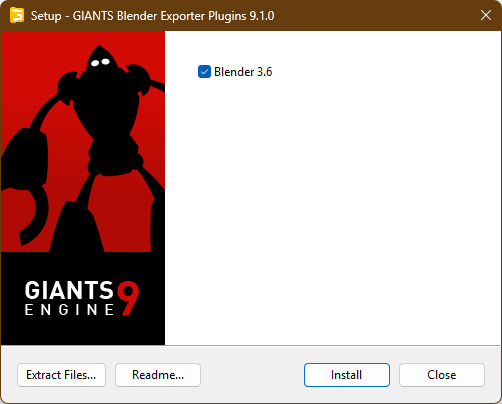
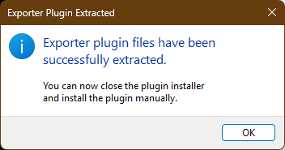
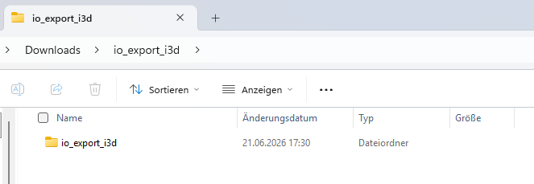
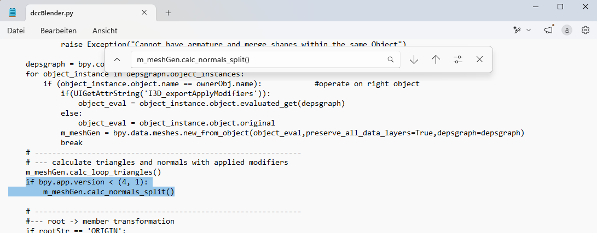
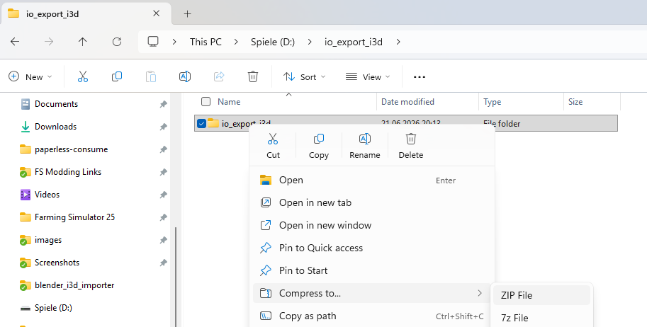
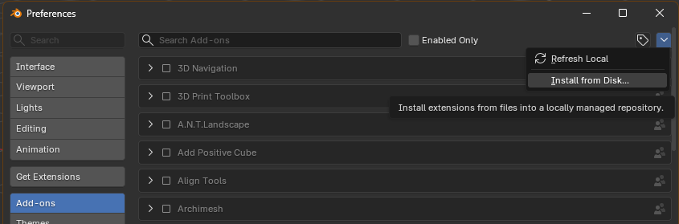
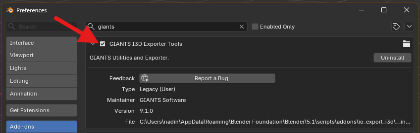
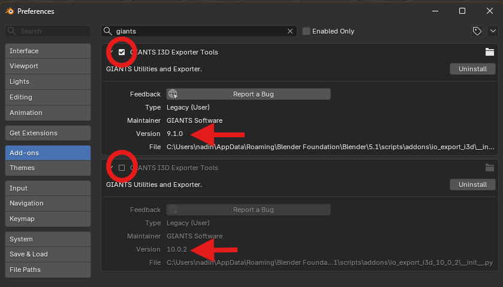
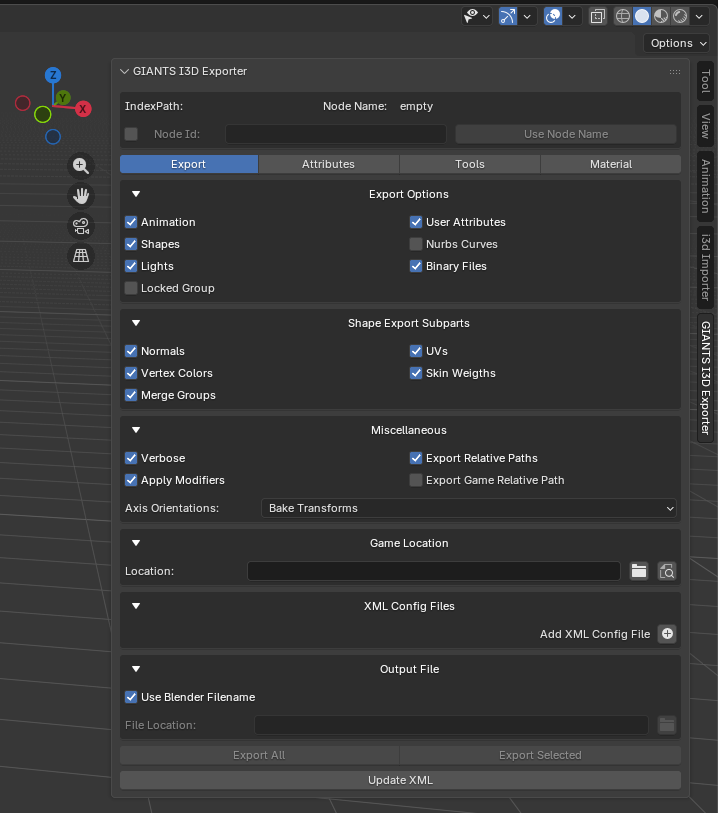

# Running the GIANTS FS22 i3D Exporter (9.1.0) on Blender 5.1

The official GIANTS i3D Exporter **9.1.0** (the FS22 exporter) is built for Blender versions between 2.83-3.6 and 3.6.9 and refuses to load on Blender 5.1. **Three small changes are all that stand in the way of running it on Blender 5.1!**
This guide walks you through getting it running on Blender 5.1 so you can **re-export** an `.i3d` that you imported with the blender-i3d-importer.

> Why you might want this: the FS22 exporter writes FS22-style `.i3d` files (single `collisionMask`, FS22 collision groups, etc.). If you mod for Farming Simulator 22, this is the toolchain you need. For FS25, use the official 10.0.2 exporter instead - it already runs on Blender 5.1. without tweaking.

These three fixes only make the exporter **run and export**. Round-trip fidelity of render attributes (castsShadows, clipDistance, nonRenderable, ...) is handled on the **importer** side, which mirrors its custom properties to the uppercase `I3D_*` names the FS22 exporter expects. Use a current importer build.

We make the three small edits **first** and only then install the add-on. That way you end up with a ready-patched `.zip` you can keep and reinstall any time (for example in a fresh Blender install) without redoing the edits.

---

## Step 1 - Download the exporter (9.1.0)

1. Go to the **GIANTS Developer Network**: https://gdn.giants-software.com
2. Sign in, go to the **Downloads** section, find **Blender Exporter Plugins**,
   and download version **9.1.0** (Windows installer `.exe`).

## Step 2 - Unpack the downloaded installer

1. Double click the downloaded installer exe. A menu will pop up where you can select the Blender version you want to install it on. No Blender version later that 3.6.9 is listed. Therefore:
2. On the same page, click `Extract Files...` instead (bottom left).

3. A folder selection comes up. Select a folder where you want to extract the files to (2 files will be extracted, a zip and a text file).
4. After extraction, you get a success message.


## Step 3 - Unzip the add-on so you can edit it

The add-on itself sits inside the `.zip` from Step 2. Unzip it so you can open the files.

1. Right-click the `.zip` from Step 2 and choose **Extract All...** (or use your unzip tool).
2. You now have a folder named **`io_export_i3d`** containing the add-on's files. This is the folder you will edit in Step 4.


## Step 4 - Apply the three fixes

You will edit three text files inside the `io_export_i3d` folder. Open each file in a plain text editor (standard Notepad works just fine; **Notepad++** or **VS Code** are a bit nicer but optional).

I will explain the fixes manually, but there is also an advanced version below if you use git. In this case, skip the manual editing and use the patch files.

> Two things matter, even if the code means nothing to you:
> - Copy the **leading spaces** of each line exactly. The first letter must be exactly in the same place as the one you replace. Python relies on the structure of the file.
> - Change **only** the lines shown below. Leave everything else untouched.

### Fix 1 - file `i3d_ui.py`

1. **Open the file** `i3d_ui.py`. 

2. **Find these two lines:**

```python
    def __init__(self):
        global g_modalsRunning
```

3. **Replace them with:**

```python
    def __init__(self, *args, **kwargs):
        super().__init__(*args, **kwargs)
        global g_modalsRunning
```

4. Save, then close the file.

*(This fix lets the Exporter's panel start correctly on Blender 4.0+.)*

### Fix 2 - file `util/selectionUtil.py`

1. Go into the `util` folder and **open the file** `selectionUtil.py`.
2. **Find the block** near the bottom of the file that starts with `def getSelectedObjects(context):`. It looks exactly like this:

```python
def getSelectedObjects(context):
    # get active object from outliner context
    # this also includes hidden objects like collision etc
    for area in context.screen.areas:
        if area.type == 'OUTLINER':
            override = context.copy()
            override['area'] = area
            with bpy.context.temp_override(area=area):
                if len(context.selected_ids) == 0:
                    if len(context.selected_objects) > 0:
                        return context.selected_objects
                else:
                    return context.selected_ids
    return []
```

3. **Replace the whole block with:**

```python
def getSelectedObjects(context):
    # get active object from outliner context
    # this also includes hidden objects like collision etc
    # Blender 4.x/5.x: context.selected_ids is only available when the
    # temp_override also carries the OUTLINER region (not just the area).
    # Mirrors the fix in the official 10.0.2 exporter.
    selected_items = []
    for area in context.screen.areas:
        if area.type == 'OUTLINER':
            try:
                context_override = {}
                context_override['area'] = area
                context_override['region'] = [region for region in area.regions if region.type == 'WINDOW'][0]

                with bpy.context.temp_override(**context_override):
                    selected_items.extend(context.selected_ids)
            except Exception as e:
                print(f"An exception occurred: {e}")
    if not selected_items:
        selected_items.extend(context.selected_objects)

    return selected_items
```
4. Save, then close the file.

*(This lets the exporter read your selected objects on Blender 4.x/5.x.)*

### Fix 3 - file `dcc/dccBlender.py` in **two** places

1. Go back to the `io_export_i3d folder`, from there into the `dcc` folder, and **open the file** `dccBlender.py`.
2. This same line appears **twice** in the file. So you have to do the find & replace two times.

3. **Find:**
```python
    m_meshGen.calc_normals_split()
```

4. **Replace with:**
```python
    if bpy.app.version < (4, 1):
        m_meshGen.calc_normals_split()
```
5. Make sure you changed it in **both** places. If you search again for the line in nr. 3, each occurence should have one new line `if bpy.app.version < (4,1):` above it. 
(If you see that line twice above it that means to edited the same place twice. Close the file without saving and try again.)
5. Save, then close the file.

*(Blender 4.1 removed this call; the `if` line simply skips it on newer Blender.)*




> **Advanced (optional):** 
***If you already did the manual fixes above, skip this step! You are done with the fixes. Proceed to Step 5.***
Instead of editing by hand you can apply the supplied `.patch` files with the `patch` tool (Git Bash / Linux / WSL):
> ```bash
> cd io_export_i3d
> patch -p0 < 01-panel-init-args.patch
> patch -p0 < 02-getselectedobjects-outliner-region.patch
> patch -p0 < 03-calc-normals-split-guard.patch
> ```
> The source files use Windows (CRLF) line endings; if `patch` complains, add `--binary`, or use the manual edits above instead.

## Step 5 - Zip it back up and install it in Blender 5.1

1. Zip the **`io_export_i3d` folder** back up (right-click the folder -> *Send to*
   -> *Compressed (zipped) folder*, or use your zip tool). 
2. Make sure the `io_export_i3d` folder sits at the **top level** of the new `.zip` file. 
3. Also make sure that you have **exactly one** folder named `io_export_i3d` inside the zip file, and not another folder `io_export_i3d` below it. (If you are unsure, compare the structure of your zip file to the original zip file before you applied the fixed it. It should be the same.)
4. **Keep this `.zip`** file somewhere safe - this is your reusable, ready-patched exporter!

   

2. Start **Blender 5.1**.
3. There are two alternative ways of installing the add-on:
  a. Drag and drop the zip file onto your Blender Window. Confirm the installation dialog.
  b. Open `Edit` -> `Preferences` -> `Add-ons`. 
     Then Click the **down-arrow (v)** in the top-right of the Add-ons panel and choose **Install from Disk...**. Select your zip file and confirm.

   


## Step 6 - Enable and test

1. In `Edit` -> `Preferences` -> `Add-ons`, search for `i3d` (or `GIANTS`) and
   tick the **GIANTS I3D Exporter** entry. Because it is already patched, it
   should enable **without** an error in the console.

   

2. Make sure that you have only one Giants Exporter active at the same time. The exporter for FS25 may be installed at the same time, but must be inactive because both have the same name. That would lead to errors. You can distinguish the two entries by looking at the version number when you expand them.
   
2. In the 3D viewport press **N** to open the side panel - a **GIANTS I3D
   Exporter** tab should appear.

   

3. Quick export test:
   - Select a test object (e.g. the default cube, or an object you imported).
   - In the exporter panel set an **Export File** path.
   - Run the export.
   - Confirm an `.i3d` and `.i3d.shapes` were written, and that the `.i3d`
     opens in the **Giants Editor** without errors.


**If all six steps pass, the exporter is working for you on Blender 5.1!**

---

## Reinstalling later / after an update

Your patched `.zip` from Step 5 already contains the fixes, so installing it again (in a new Blender, on another PC, ...) needs **no** extra work - just *Install from Disk* or via *Drag & Drop* with that zip file.

This will also work with newer Blender versions **until** Blender changes something which breaks it.
